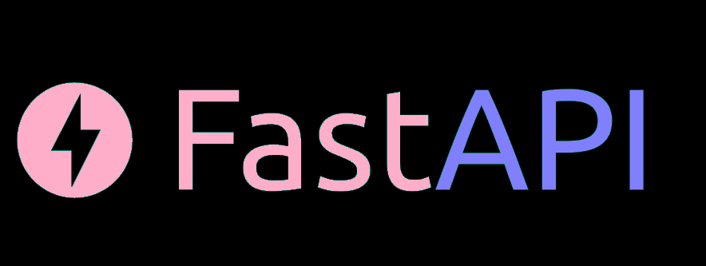
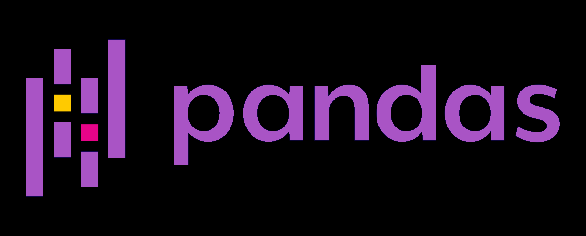
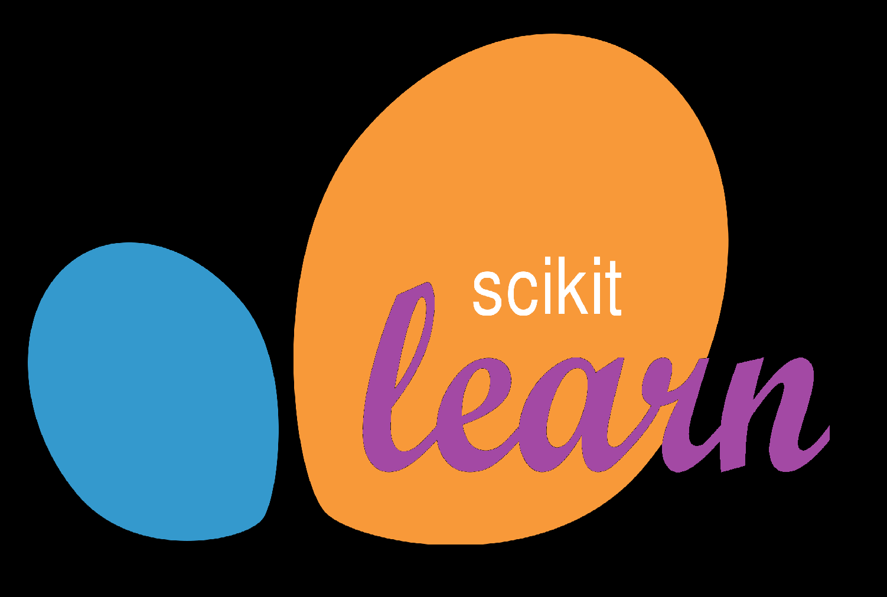
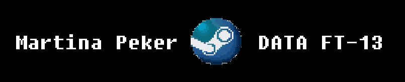

# Proyecto ML-OPS: Predicción de Precio de Videojuegos

  

##En este proyecto, llevaremos a cabo un modelo de Machine Learning utilizando un dataset público y una API lista para su consumo. La API proporciona un servicio de predicción de precio de videojuegos basado en un modelo de aprendizaje supervisado. La idea es simular el rol de un ML-Ops.

  

## Consignas

Las consignas están especificadas en el siguiente repositorio: [PI_ML_OPS](https://github.com/soyHenry/PI_ML_OPS/blob/ft/Readme.md)

## Herramientas utilizadas en este proyecto:

  
  
  
  

## Características

- Todas las librerías necesarias para correr este proyecto se encuentran en el archivo `requirements.txt`.
- Las funciones de la API se encuentran en el archivo `main.py`.
- Los archivos `.ipynb` contienen el EDA y ETL realizados.

## Deploy de la App

La aplicación está desplegada en [Render](https://mlops-steam-peker.onrender.com/).
(El modelo acepta los parametros year (YYYY) y genres (si se requiere probar varios generos, puede estar separado por ",")
Los generos con los que fue entrenado el modelo son: 'Action','Adventure','Casual','Early Access','Free to Play','Indie','Massively Multiplayer','RPG','Racing','Simulation','Sports','Strategy'
Cualquiera de estos generos debe ser tipeado con su mayus correspondiente. (Por falta de tiempo no he llegado a optimizar esos detalles.)

## A continuación, adjunto el video donde muestro la funcionabilidad de la misma desde render.

[]

  

